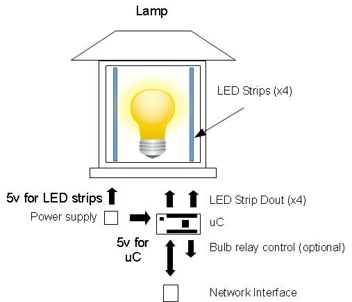

# SmartLamp
Take 1 AC Lamp, a uController, a normal LED bulb and some color LED strips to get a functional lamp that also can send colored alerts.

## Part List

 * 1 × AC Lamp A Japanese lamp or a lantern. Something that is opaque
 * 1 × Bulb LED or CFL, something bright enough for the area but not something that will get too hot
 * 1 × Teensy-LC mini micro-controller
 * 1 × power supply AC/DC power supply
 * 1 × RGB LED strip addressable RGB LED strip
 * 1 × LED drivers
 * 1 × w550io or ESP8266 SPI network interface

